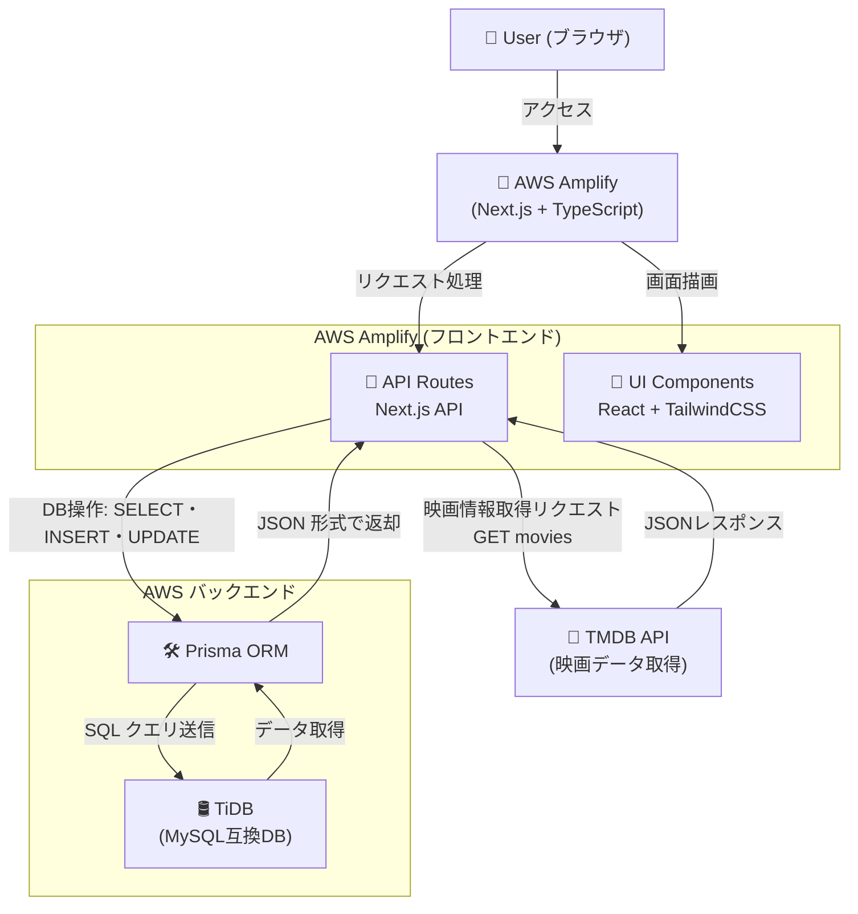

# 要件定義書

プロジェクト名：「映画投票アプリ」

# 概要

シュアハウスの住人向けのサービスである。想定ユーザー数は 20 名程度  
次に見たい映画を自由に投票・追加できる web アプリサービス

本プロジェクトの開発の目的は、みたい映画を自由に共有できることで、住民同士の交流を促進させることを目的とする。  
画面デザインはスマートフォンのみ対象とする。（PC での画面レイアウトは対象外とする）  
また、本アプリの利用は無料とし、マネタイズは本プロジェクトの対象外とする。

## 開発の優先順位

本プロジェクトは、何よりもまずユーザーに素早く価値を提供することを第一優先とする。  
よって、「重厚なドキュメントよりも、動くアプリ」をユーザーに提供することを重視する。  
プロトタイプを作成し、ユーザーに実際に使ってもらうことでフィードバックを得て、機能の改善に取り組む。

# システム要件

## 画面デザイン
https://github.com/hato-taka/TMDb-api/blob/main/docs/requirements/v1.0/mock-up.png

モックアップ: https://main.d27y2h250yphml.amplifyapp.com/

## 技術スタック

### フロントエンド
- React
- Next.js
- typescript
- Tailwind CSS
- prisma: ORMラッパー

### API
- TMDB API: 映画情報を取得 https://www.themoviedb.org/

### DB
- TiDB

### デプロイ
- AWS amplify

### コード管理・ドキュメント管理
- Github

## システム構成の概要
プロトタイプ開発のため、すぐにデプロイしやすいamplifyを採用した。  
またなるべく開発費用を抑えるために、DBはTiDBの無料枠を利用することにした。  
想定ユーザー数が最大でも30名程度なので、無料枠内の利用で十分なキャパシティーと判定した。

- Next.js と typescript で開発
- DB は TiDB を利用する
- AWS amplify でデプロイする
- TMDB の API を利用して映画情報を取得する
- DB 操作は Prisma で行う

## システム構成図

# 機能要件

- ユーザーが自由に「観たい映画一覧」に新しい映画を追加できる
- ユーザーが自由に「いいね！」ボタンを押せる
- 累計の「いいね！」数が表示される

## 機能一覧

| No. | カテゴリー   | 優先度 | 要求内容                         |
| --- | ------------ | ------ | -------------------------------- |
| 1   | いいねボタン | 高     | ユーザーが観たい映画に投票できる |
| 2 | 検索機能 | 高 | ユーザーが観たい映画をリストに追加できる |
| 3 | LINEアプリとの連携 | 中 | ライン上からアプリの閲覧・操作が可能である |

# 非機能要件

## パフォーマンス要件

- ユーザー操作から画面の描画までに、著しい遅延が発生しない
- データベースのデータの整合性が取れていること

# 参考記事一覧

- [要件定義書 テンプレート](https://notepm.jp/template/requirement-definition)
- https://qiita.com/syantien/items/9a8a7cbaeca2be3ef0d7
