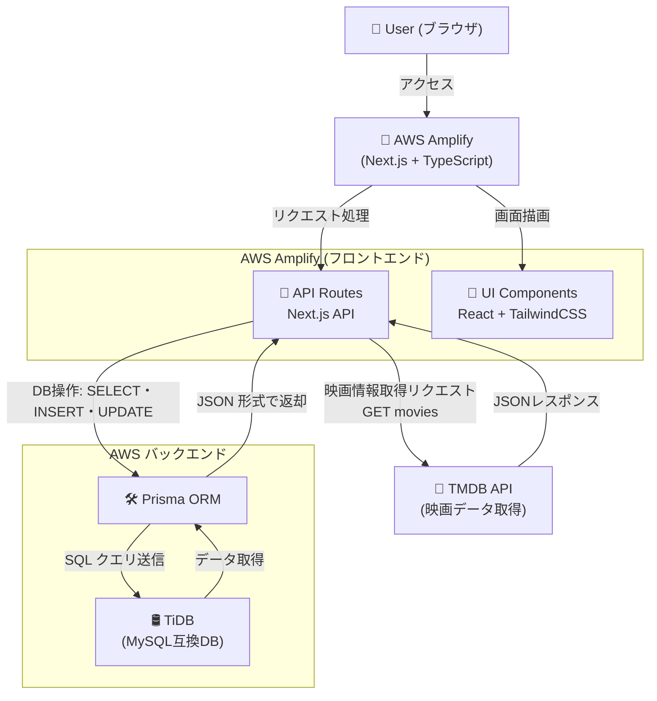

# 要件定義書

プロジェクト名：「映画投票アプリ」

# 概要

シュアハウスの住人向けのサービスである。想定ユーザー数は20名程度    
次に見たい映画を自由に投票・追加できるwebアプリサービス

## 開発の優先順位

本プロジェクトは、何よりもまずユーザーに素早く価値を提供することを第一優先とする。  
よって、「重厚なドキュメントよりも、動くアプリ」をユーザーに提供することを重視する。  
プロトタイプを作成し、ユーザーに実際に使ってもらうことでフィードバックを得て、機能の改善に取り組む。

# システム要件

- Next.js と typescript で開発
- DBはTiDBを利用する
- AWS amplify でデプロイする
- TMDBのAPIを利用して映画情報を取得する
- DB操作はPrismaで行う

## システム構成図

# 機能要件
- ユーザーが自由に「観たい映画一覧」に新しい映画を追加できる
- ユーザーが自由に「いいね！」ボタンを押せる
- 累計の「いいね！」数が表示される

# 非機能要件

## パフォーマンス要件
- ユーザー操作から画面の描画までに、著しい遅延が発生しない
- データベースのデータの整合性が取れていること

# 参考記事一覧
- [要件定義書 テンプレート](https://notepm.jp/template/requirement-definition)
- https://qiita.com/syantien/items/9a8a7cbaeca2be3ef0d7